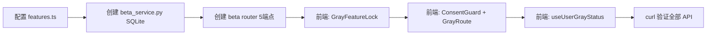
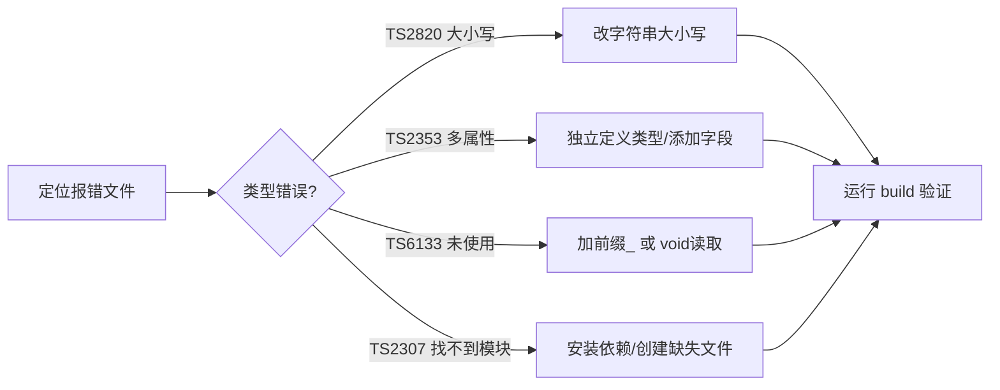

# 自定义技能库.md

> Hermes Agent 自定义技能清单，用于复用已验证的工作流程和避免重复劳动。

## 🔧 可用技能

以下是当前 Hermes 系统中已注册的技能（按类别分组）：

### 构建部署类
| 技能名 | 描述 |
|--------|------|
| `fastapi-render-deployment` | 部署 FastAPI 到 Render.com |
| `github-render-deployment` | GitHub 推送 + Render 部署全流程 |
| `render-sentry-fastapi-setup` | Render + Sentry 监控配置 |
| `windows-git-deployment` | Windows 项目推送到 GitHub |

### 前端开发类
| 技能名 | 描述 |
|--------|------|
| `daw-frontend-development` | DAW 前端开发（多轨编辑器/音频剪辑/MIDI等）|
| `design-system-rollout` | 设计系统应用到 React/Vite 项目 |
| `music-video-platform-dev` | Music Video Platform React+TS 开发 |
| `music-video-platform-local-dev` | 本地开发环境启动 |
| `baoyu-article-illustrator` | 文章插图生成 |
| `baoyu-comic` | 知识漫画生成 |
| `claude-design` | HTML 设计稿生成 |
| `excalidraw` | Excalidraw 架构图生成 |
| `p5js` | p5.js 创意编程 |

### AI 集成类
| 技能名 | 描述 |
|--------|------|
| `mureka-api` | Mureka 音乐生成 API 集成 |
| `kling-ai-video-generation` | 可灵 AI 视频生成集成 |
| `ai-music-integration` | AI 音乐 API 集成指南 |
| `comfyui` | ComfyUI（图像/视频/音频生成）|
| `segment-anything-model` | SAM 图像分割 |
| `llama-cpp` | llama.cpp GGUF 本地推理 |
| `huggingface-hub` | HuggingFace CLI 操作 |

### 性能优化类
| 技能名 | 描述 |
|--------|------|
| `rapid-product-improvement` | 快速产品改进工作流 |
| `codebase-audit` | 全项目代码审计 |
| `simplify-code` | 并行 3-agent 代码清理 |
| `main-py-refactor` | main.py 路由提取 |
| `fastapi-router-modularization` | FastAPI 路由模块化 |

### 生态 & 服务类
| 技能名 | 描述 |
|--------|------|
| `obsidian` | Obsidian 笔记管理 |
| `notion` | Notion API 集成 |
| `github-pr-workflow` | GitHub PR 生命周期 |
| `github-code-review` | PR 代码审查 |
| `github-issues` | GitHub Issues 管理 |
| `canvas` | Canvas LMS 课程管理 |
| `himalaya` | 终端邮件管理 |
| `google-workspace` | Google 办公套件 |
| `airtable` | Airtable API |
| `openhue` | Philips Hue 智能灯控 |

### 创意生成类
| 技能名 | 描述 |
|--------|------|
| `ascii-art` | ASCII 艺术字 |
| `ascii-video` | ASCII 视频生成 |
| `manim-video` | Manim 动画视频 |
| `architecture-diagram` | SVG 架构图 |
| `humanizer` | AI 文本人性化 |

## 📋 常用工作流

### 1. 公测灰度系统搭建


### 2. 修复 TS 编译错误流


### 3. Render 部署流程
```bash
# 1. 本地 git push
git push origin main
# 2. 等待 Render 自动部署 (约2min)
# 3. 如果失败: Render Dashboard → Manual Deploy → Clear build cache & deploy
# 4. 验证: curl https://xxx.onrender.com/api/v1/beta/status
```

## 🧠 技能组合建议

**场景：新功能上线**
1. `music-video-platform-dev` — 开发
2. `fastapi-render-deployment` — 后端部署
3. `render-sentry-fastapi-setup` — 监控配置
4. `music-video-platform-local-dev` — 本地验证

**场景：性能 & 代码优化**
1. `simplify-code` — 代码清理
2. `codebase-audit` — 全面审计
3. `fastapi-router-modularization` — 模块化

**场景：AI 功能扩展**
1. `mureka-api` — 音乐生成
2. `llm-api-key-config` — API Key 配置
3. `huggingface-hub` — 模型下载/上传